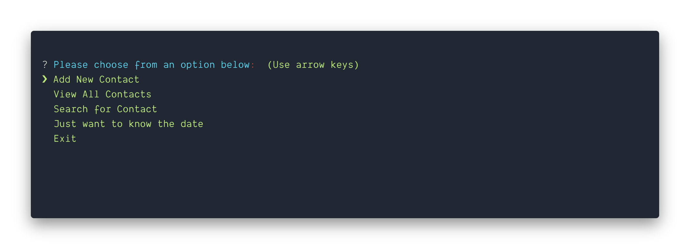

[](https://app.codacy.com/app/csantiago132/node-address-book?utm_source=github.com&utm_medium=referral&utm_content=csantiago132/node-address-book&utm_campaign=Badge_Grade_Dashboard)
[](https://circleci.com/gh/csantiago132/node-address-book)

# Node Address Book

<p align="center"></p>

A CLI application that will allow you to store and retrieve contacts from an
address book thru Node.js using Sequelize on a PostgreSQL database.

## Prerequisites

> - PostgreSQL
> - Yarn >= 1.5.x
> - Node >=10.x

## Getting Started

1. Clone this repo using
   `git clone https://github.com/csantiago132/node-address-book.git`
2. Move to the appropriate directory: `cd node-address-book`
3. Run `yarn install` to install dependencies
4. If you don't have Postgres installed on your computer, please
   [download](https://www.openscg.com/bigsql/postgresql/installers.jsp/) and
   install using the installer for your operating system.
5. Create the databases for the application by running the `createdb` command:

- A database to use in the application
- a database for testing the application

```bash
  createdb -U postgress -w addressBook
  createdb -U postgress -w addressBookTest
```

6. start your database by running the following command:
   `pg_ctl -D /usr/local/var/postgres[VERSION NUMBER HERE] start`

- If your postgres folder does not have a version number, run
  `pg_ctl -D /usr/local/var/postgres start`

7. On the terminal, note the port number where Postgres listens for requests.

- Go to `db/config/config.json` and place that number in the `port` property:

```json
  "development": {
    "port": YOUR_PORT_NUMBER_HERE,
```

8. Run the migration scripts `yarn run migrateDb` on the terminal

- this will run `sequelize db:migrate && sequelize db:migrate --env test`

**Your database is now ready to accept contacts.**

## Features

- [x] CircleCI integration
- [x] Jazmine test environment
- [x] Husky pre-commit hooks (to lint and format the code)
- [x] Add new contacts to the database
- [x] View all contacts stored on the database
- [x] Search for contacts stored on the database
- [x] Gets you current date and time

## TODO List

In the near future, I want to add:

- [ ] Increase tests stuites
- [ ] Add coverage report thru Coveralls
- [ ] Build a front-end and create an UI for the application
